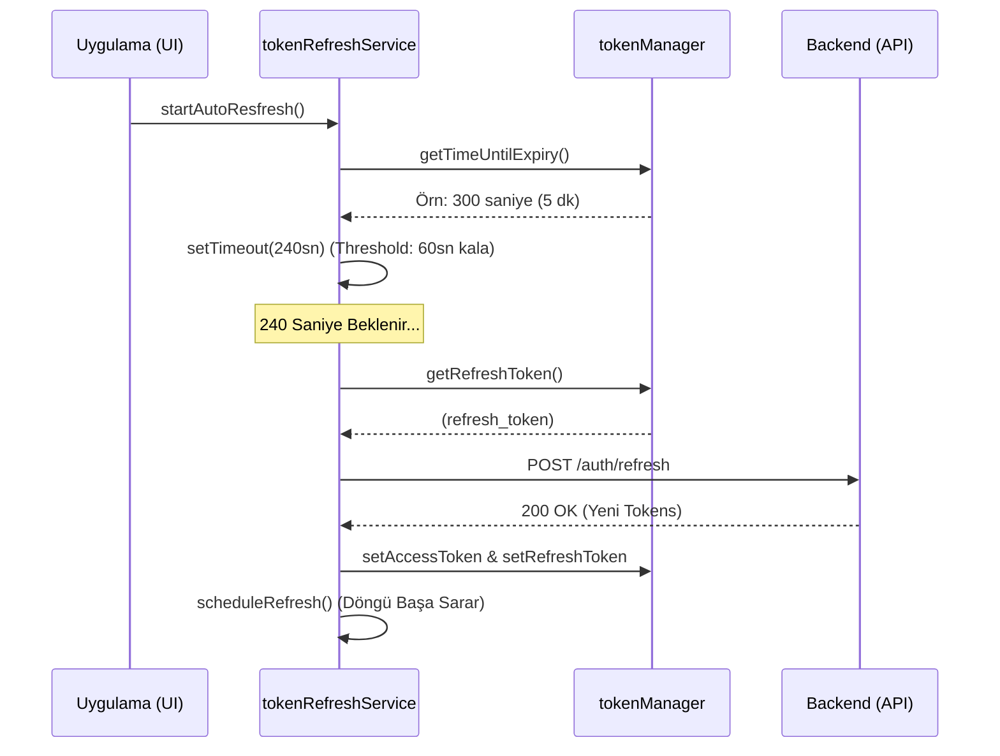
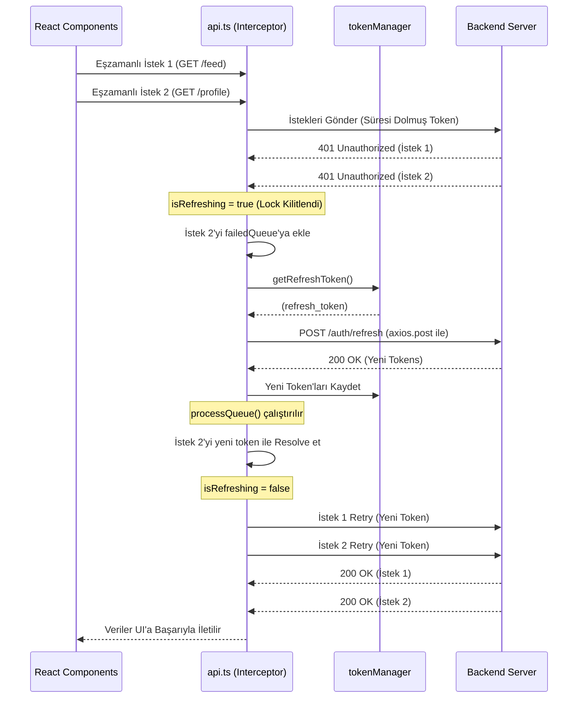

# 🏗 React Native (Expo) Boilerplate Mimari Yaşam Döngüsü Belgesi

Bu doküman, uygulamanın kritik servislerinin (Auth, API, State, Navigation) birbiriyle olan asenkron ve senkron etkileşimlerini, uçtan uca yaşam döngülerini (Lifecycle) standartlaştırmayı amaçlamaktadır.

## 1. Auth & Token Yaşam Döngüsü (Lifecycle)

### 1.1. Uygulama Açılışı (App Bootstrap) ve Yönlendirme
Uygulama başlatıldığında, arayüzün kullanıcıya gösterilmesinden önceki kritik süreç `useAppReady.ts` hook'u ile yönetilir.

1. **Mount & Hold Aşaması:** `useAppReady` hook'u tetiklenir ve Expo'nun `SplashScreen.preventAutoHideAsync()` metodu çağrılarak uygulamanın splash ekranı UI render olana dek ekranda kilitlenir.
2. **Local Storage (Secure) Kontrolü:** `expo-secure-store` (veya `react-native-keychain`) üzerinden saklanan mevcut `access_token` ve `refresh_token` asenkron olarak okunur.
3. **Silent Auth (`silentAuthService.ts`):** 
   - Token bulunursa, `silentAuthService` arka planda token'ın süresini (JWT decode ve expire time üzerinden) kontrol eder.
   - Token süresi çoktan dolmuşsa ancak elde geçerli bir refresh token varsa, arka planda session tazelenir.
   - Doğrulama işlemi başarılıysa, profile ait kullanıcı verileri Zustand store'una (`useAuthStore`) hidrate edilir.
4. **Navigasyon Kararı (Expo Router):**
   - **Doğrulandı:** Zustand üzerinde `isAuthenticated: true` set edilir. Expo Router'ın file-based layout seviyesinde (genellikle kök `_layout.tsx` veya bir `ProtectedRoute` component'i aracılığıyla) kullanıcı doğrudan `app/(protected)/(tabs)` grubuna geçirilir.
   - **Doğrulanamadı:** Token yoksa veya yenileme başarısız olursa (`isAuthenticated: false`), kullanıcı `app/(auth)` altındaki login/register ekranlarına yönlendirilir.
5. **Render Aşaması:** Tüm işlemler tamamlandığında `SplashScreen.hideAsync()` çağrılır ve native rendering tamamlanır.

### 1.2. Çift Katmanlı (Dual-Layer) Token Yenileme Stratejisi
Uygulama, oturum sürekliliğini sağlamak için birbirini yedekleyen "Proaktif" ve "Reaktif" olmak üzere iki katmanlı bir token yenileme mimarisi kullanır.

**A. Proaktif Yenileme (Auto Refresh - `tokenRefreshService.ts`):**
Kullanıcı uygulamayı aktif kullanırken 401 hataları almasını önleyen ana mekanizmadır.
1. **Timer Kurulumu:** Access token alındığında, `tokenRefreshService.ts` içindeki `startAutoResfresh()` metodu tetiklenir.
2. **Erken Yenileme:** Servis, token'ın süresinin bitmesine tam 60 saniye (`REFRESH_THRESHOLD`) kala tetiklenecek bir `setTimeout` planlar.
3. **Sessiz Güncelleme:** Süre dolduğunda arka planda `/auth/refresh` isteği atılır, yeni token'lar `tokenManager` üzerinden Secure Storage'a yazılır ve timer kendini yeniden kurar.

**B. Reaktif Yenileme ve Race Condition Kontrolü (`api.ts` Interceptor):**
Eğer uygulama uzun süre arka planda (background) kalırsa ve işletim sistemi timer'ı (setTimeout) durdurursa, API istekleri 401 Unauthorized dönecektir. Bu durumda Axios Interceptor devreye girer:
1. **Interceptor Yakalaması:** 401 hatası düştüğünde, `api.ts` içerisindeki Error Interceptor tetiklenir.
2. **Kuyruk ve Kilitleme (Queue & Lock):** 
   - Birden fazla istek aynı anda 401 alırsa, sınıf içindeki `isRefreshing` bayrağı `true` yapılır.
   - İlk istek refresh sürecini başlatırken, eşzamanlı gelen diğer tüm istekler `failedQueue` (Promise dizisi) içerisine alınarak bekletilir.
3. **Retry (Yeniden Deneme):** Refresh işlemi başarılı olduğunda, `processQueue` metodu çalıştırılarak bekleyen tüm isteklerin Authorization header'ları güncellenir ve kaldıkları yerden otomatik olarak yeniden gönderilir. İşlem başarısız olursa kuyruk boşaltılır ve kullanıcı çıkışa yönlendirilir.

---

## 2. Component & State Yaşam Döngüsü

### 2.1. Zustand (Client State) ve React Query (Server State) Senkronizasyonu
Uygulamanın durumu sorumluluklarına göre iki katmana ayrılmıştır:
- **Zustand:** Anlık UI durumları (aktif modallar, tema, çoklu dil, filtre state'leri) ve global user session state'ini tutar.
- **TanStack React Query v5:** API verilerinin önbelleklenmesi (cache), deduplication (mükerrer isteklerin önlenmesi), re-fetching ve background sync süreçlerini yönetir.

**Senkronizasyon Döngüsü:**
- Bir ekran mount edildiğinde Zustand'dan aktif arama veya filtre parametreleri alınır ve bu state, `useQuery`'nin `queryKey` array'ine doğrudan beslenir.
- Kullanıcı Zustand üzerindeki bir filtreyi değiştirdiğinde (Client State update), bileşen re-render olur, değişen `queryKey` nedeniyle React Query yeni bir fetch işlemi başlatır (Server State update).
- Kritik Server Mutasyonlarında (`useMutation` -> `onSuccess`), profil resmi değiştirme gibi işlemlerde, hem React Query cache'i (`queryClient.invalidateQueries`) geçersiz kılınır hem de Zustand içindeki lokal kullanıcı profil datası senkron kalması için güncellenir.

### 2.2. React Query Cache Mekanizması ve Garbage Collection
- **Mount (Görünür Olma):** Bileşen mount olduğunda veriler çekilir. Elde edilen veri, ayarlanan `staleTime` boyunca taze sayılır. Bu süre bitmeden bileşen tekrar mount olursa veya focus alırsa, network request atılmaz.
- **Unmount (Gizlenme) ve Çöp Toplama:** Bir bileşen unmount edildiğinde, o API endpoint'ini dinleyen observer sayısı sıfıra düşer. Veri, v5 ile gelen **`gcTime`** (eski `cacheTime`) yaşam sayacına alınır.
- Sayım esnasında ekran tekrar açılmazsa, **Garbage Collector (GC)** süresi dolan veriyi cihaz belleğinden (RAM) kalıcı olarak siler ve olası memory over-allocation durumlarını önler.

---

## 3. Navigasyon Yaşam Döngüsü (Expo Router)

Expo Router file-based mimarisi ile route'lar arası geçişte bileşenlerin yaşam döngüleri farklılık gösterir.

### 3.1. Route Geçişleri ve Bileşen Tetiklenmeleri
- **(auth) <-> (tabs) Geçişleri (Root Exchange):** 
  - Bu işlem stack sıfırlaması anlamına gelir. `(auth)` içerisindeki tüm bileşenler tamamen `unmount` edilir ve `(tabs)` stack'i ilk defa `mount` edilir.
- **(tabs) İçindeki Sekmeler Arası Geçişler:**
  - Expo Router, Bottom Tabs kullanıldığında ekranları performans için bellekte tutar (Keep-Alive mimarisi). 
  - Bir tab ilk kez açıldığında `mount` olur. Başka bir taba geçip geri gelindiğinde ekran **`unmount` olmaz** ve tekrar `mount` edilmez. Sadece odak değişir.
  - Bu sebeple, sekme açıldığında her seferinde çalışması gereken bir log veya veri tetikleme işlemi varsa bu `useEffect` ile **yapılamaz**. Yerine `useFocusEffect` (veya `useIsFocused`) tercih edilmelidir.

### 3.2. Memory Leak (Bellek Sızıntısı) Önleme ve Cleanup
Ekranların bellekte tutulma eğiliminden dolayı cleanup mimarisi kritiktir:
1. **Abonelikler (Subscriptions):** Firebase, WebSockets veya DeviceEventEmitter dinleyicileri `(tabs)` içerisindeyseniz ekran unmount olmadığı için arka planda sürekli çalışmaya devam edecektir.
   - *Çözüm:* Abonelikler `useFocusEffect` içine alınmalı ve focus kaybedildiğinde döndürülen `return () => {}` callback'i ile abonelik koparılmalıdır (unsubscribe).
2. **Intervals & Animations:** `setInterval` döngüleri ve `react-native-reanimated` worklet'leri focus kaybedilince dondurulmalıdır.

---

## 4. App State (Uygulama Durumu) Yaşam Döngüsü

İşletim sistemi (iOS/Android) uygulamayı arka plana attığında (Background) veya ön plana aldığında (Foreground) çalışan lifecycle:

- **Background (Arka Plan):**
  - OS genellikle network thread'lerini kısıtlar. WebSocket bağlantıları varsa heartbeat durdurulmalı/koparılmalı ve JS tarafındaki anlık senkronizasyon pause edilmelidir.
- **Foreground (Ön Plan):**
  - **React Query (`refetchOnWindowFocus`):** Kullanıcı uygulamayı tekrar açtığında `AppStatus` state'i `active`'e döner. TanStack Query'nin native adaptörleri sayesinde "stale" durumdaki `useQuery`'ler otomatik olarak tekrar tetiklenir ve ekrandaki veri güncellenir.
  - **Token Validasyonu:** Uygulama günler sonra foreground'a alınırsa, `silentAuthService` uygulama uyanır uyanmaz interceptor beklenmeden token geçerliliğini denetleyebilir.
  - **Soket Reconnect:** WebSocket bağlantıları gerekiyorsa Exponential Backoff algoritmasıyla tekrar bağlanma döngüsüne sokulur.

---

## 5. Token Rotasyonu ve Refresh Akış Şeması (Sequence Diagram)

Yeni mimariye göre, token yenileme süreci iki farklı senaryoda gerçekleşir.

### Senaryo A: Proaktif Arka Plan Yenilemesi (Timer Based)
Uygulama aktifken çalışan, kullanıcının hissetmediği akış.

### Senaryo B: Reaktif Interceptor ve Race Condition Handling
Uygulama arka plandayken timer'ın uyuması ve UI'ın eşzamanlı 401 hatası alması durumunda çalışan kurtarma akışı.

