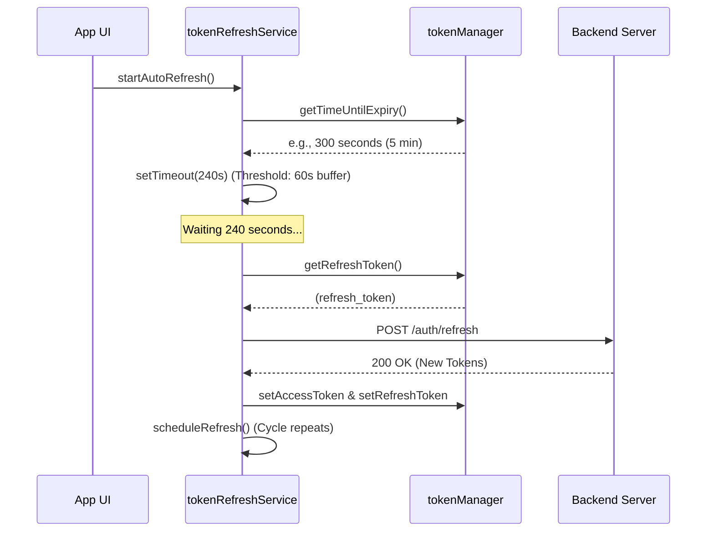
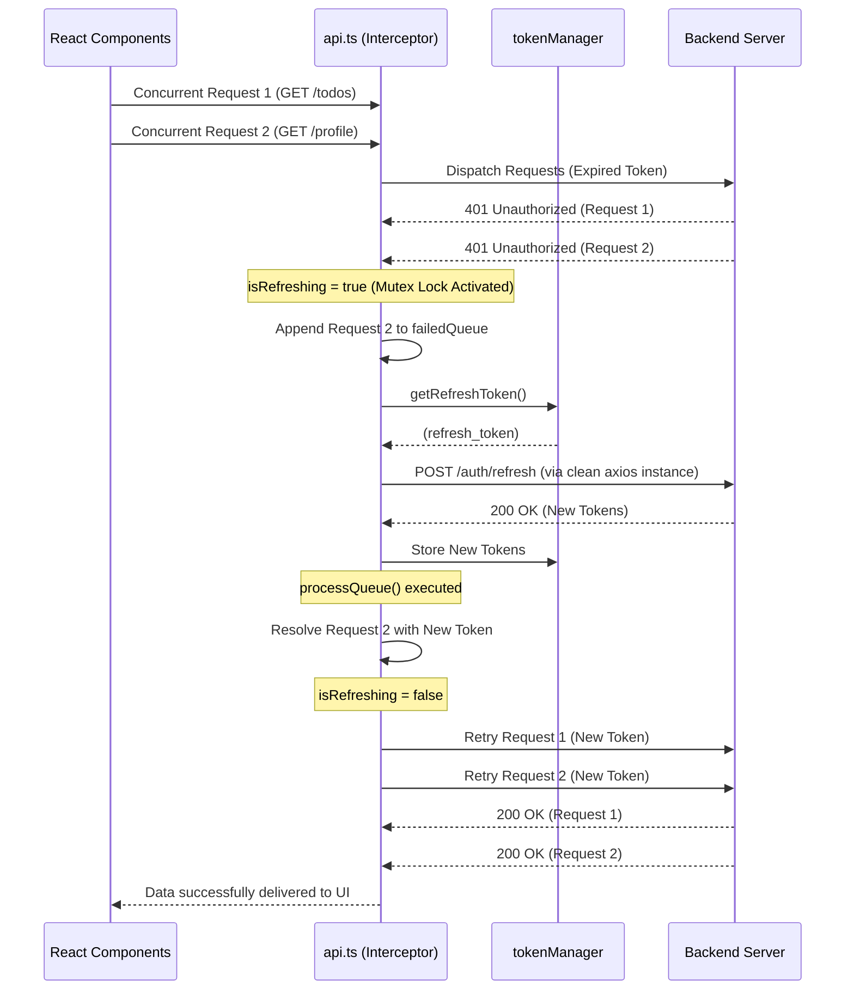

# 🏗️ TodoApp (React Native Expo Boilerplate & Architectural Masterpiece)


**TodoApp** is a premium, production-grade React Native (Expo) task management application and highly scalable architectural boilerplate. Engineered with uncompromising clean code standards, Feature-Sliced Design (FSD), and advanced state synchronization, this project establishes bulletproof lifecycle patterns for secure authentication, dual-layer token rotation, extreme FlatList virtualization, and robust background memory management.

---

## 🚀 Tech Stack

- **Core Framework**: [React Native](https://reactnative.dev/) powered by [Expo (SDK 51+)](https://expo.dev/)
- **Language**: [TypeScript](https://www.typescriptlang.org/) for complete, end-to-end static type safety
- **Navigation**: [Expo Router (v3)](https://docs.expo.dev/router/introduction/) for intuitive, file-based routing and deep linking
- **Client State Management**: [Zustand](https://github.com/pmndrs/zustand) for lightweight, un-opinionated, and selector-optimized global UI state
- **Server State Management**: [TanStack React Query v5](https://tanstack.com/query/latest) for request deduplication, advanced caching, garbage collection, and optimistic UI updates
- **Secure Storage**: [Expo SecureStore](https://docs.expo.dev/versions/latest/sdk/securestore/) for hardware-encrypted token and session persistence
- **Design System**: Feature-themed custom atomic UI components (`Card`, `Checkbox`, `Input`, `Button`, `EmptyState`) built with robust vanilla stylesheets

---

## ✨ Key Features

- **🔐 Bulletproof Remember Me & Silent Auth Flow**: Advanced memory/persistent hybrid session handling. Fully respects user privacy choices (`rememberMe: false`) across app restarts without leaking tokens to storage.
- **🔄 Dual-Layer Token Refresh Architecture**: 
  - *Proactive Refresh (`tokenRefreshService`)*: Background timer-based token rotation triggered before expiration to ensure zero user interruption.
  - *Reactive Interceptor (`api.ts`)*: Axios interceptor with advanced request queueing and mutex locking to elegantly recover from concurrent `401 Unauthorized` responses without race conditions.
- **⚡ High-Performance FlatList Virtualization**: Fully optimized lists utilizing stable references (`useCallback`), precalculated view layouts (`getItemLayout`), and strict memoization (`React.memo`) to guarantee 60 FPS scrolling with minimal memory footprint.
- **🧩 Feature-Sliced Design (FSD)**: Clean modular architecture separating UI presentation from business logic (Single Responsibility Principle) and network mutations (Dependency Inversion Principle).
- **🛡️ Custom Backend Synergy**: Out-of-the-box compatibility with customized REST APIs, supporting versatile token key destructuring (`accessToken` / `access_token`) and automated bearer header management.

---

## 🛠️ Getting Started

Follow these step-by-step instructions to clone, configure, and run the project locally on your development machine.

### Prerequisites

Ensure you have the following installed before proceeding:
- **[Node.js](https://nodejs.org/)** (v18.x or v20.x LTS recommended)
- **[Git](https://git-scm.com/)**
- **[Expo Go](https://expo.dev/client)** app installed on your iOS/Android physical device, or an active iOS Simulator / Android Emulator.

### 1. Clone the Repository

```bash
git clone https://github.com/your-username/TodoApp-expo-app.git
cd TodoApp-expo-app
```

### 2. Install Dependencies

Use `npm`, `yarn`, or `pnpm` to install the project packages:

```bash
npm install
# or
yarn install
# or
pnpm install
```

### 3. Set Up Environment Variables

Create an `.env` file in the root directory of the project and define your custom backend API URL:

```bash
# Example .env configuration
EXPO_PUBLIC_API_URL=https://api.yourcustombackend.com/v1
```

### 4. Run the Local Development Server

Start the Expo development server:

```bash
npx expo start
```

- Press **`a`** to open the app on an Android Emulator.
- Press **`i`** to open the app on an iOS Simulator.
- Press **`w`** to open the app on the web.
- Scan the **QR code** generated in your terminal using the Expo Go app on your physical device.

---

## 📱 Screenshots / UI

<!-- Placeholder for future screenshots -->
<div align="center">
  <table>
    <tr>
      <td align="center"><b>Login Screen</b></td>
      <td align="center"><b>Tasks Dashboard</b></td>
      <td align="center"><b>Empty State</b></td>
    </tr>
    <tr>
      <td></td>
      <td></td>
      <td></td>
    </tr>
  </table>
</div>

---

## 📐 Architecture & Lifecycle Deep Dive

### 1. Auth & Token Lifecycle

#### 1.1 App Bootstrap & Route Redirection (`useAppReady.ts`)
The critical startup sequence before rendering the UI to the user is securely orchestrated by the `useAppReady.ts` hook:

1. **Mount & Hold Phase**: The `useAppReady` hook triggers and calls `SplashScreen.preventAutoHideAsync()`, locking the native splash screen in place until the application is fully rehydrated.
2. **Secure Local Storage Check**: Asynchronously reads the existing `access_token` and `refresh_token` from hardware-encrypted storage (`expo-secure-store`).
3. **Silent Auth (`silentAuthService.ts`)**: 
   - If a token is found, `silentAuthService` inspects the token's validity and expiration time in the background.
   - If the access token has expired but a valid refresh token exists, the session is seamlessly renewed via background rotation.
   - Upon successful verification, user profile data is hydrated directly into the Zustand store (`useAuthStore`).
4. **Navigation Decision (Expo Router)**:
   - **Verified (`isAuthenticated: true`)**: Directs the user instantly into the protected `app/(protected)/(tabs)` navigation group via root layout evaluation.
   - **Unverified (`isAuthenticated: false`)**: If no valid tokens exist or refresh fails, the user is safely redirected to the onboarding and authentication stack `app/(auth)`.
5. **Native Render Phase**: Once all async routines complete and the layout settles, `SplashScreen.hideAsync()` is invoked to deliver a perfectly smooth transition with zero visual flickering.

---

#### 1.2 Dual-Layer Token Refresh Strategy
To guarantee uninterrupted user sessions, the application implements a robust dual-layer token renewal architecture combining "Proactive" and "Reactive" fallback strategies.

**A. Proactive Refresh (Auto Refresh - `tokenRefreshService.ts`)**  
The primary defense mechanism designed to prevent `401 Unauthorized` errors while the user actively interacts with the app.
1. **Timer Setup**: Upon receiving a valid access token, `startAutoRefresh()` is triggered within `tokenRefreshService.ts`.
2. **Early Renewal**: The service calculates the exact expiration time and schedules a `setTimeout` to execute precisely 60 seconds (`REFRESH_THRESHOLD`) before token expiration.
3. **Silent Update**: When the timer fires, a background `/auth/refresh` request is dispatched. The fresh tokens are persisted to Secure Storage via `tokenManager`, and the timer automatically resets itself for the next cycle.

**B. Reactive Refresh & Race Condition Control (`api.ts` Interceptor)**  
If the app remains in the background for an extended period and the operating system suspends the JavaScript timer, subsequent API calls will inevitably encounter `401 Unauthorized`. The Axios interceptor serves as the ultimate safety net:
1. **Interceptor Interception**: Upon receiving a `401` status, the error interceptor within `api.ts` instantly activates.
2. **Queue & Mutex Locking**: 
   - If multiple concurrent network requests encounter `401` simultaneously, the `isRefreshing` mutex flag is locked (`true`).
   - The first request initiates the token refresh routine, while all concurrent requests are intercepted and appended to the `failedQueue` (an array of unresolved Promises).
3. **Automated Retry**: Once the refresh succeeds, `processQueue()` is executed. All queued requests receive the fresh `Authorization` header and are automatically re-dispatched to the server. If the refresh fails, the queue is purged, and the user is securely logged out.

---

### 2. Component & State Lifecycle

#### 2.1 Zustand (Client State) and React Query (Server State) Synchronization
Application state is strictly segregated based on domain responsibilities:
- **Zustand (Client State)**: Manages ephemeral UI states (active modals, themes, multi-language toggles, filter preferences) and the global user session object.
- **TanStack React Query v5 (Server State)**: Orchestrates server data caching, request deduplication, background refetching, and pagination.

**Synchronization Cycle**:
- When a screen mounts, active search queries or filter parameters are extracted from Zustand and injected directly into the `useQuery` `queryKey` array.
- When the user alters a filter preference in Zustand (Client State update), the updated `queryKey` triggers React Query to effortlessly initiate a clean background fetch (Server State update).
- On critical server mutations (e.g., updating a user profile via `useMutation` `onSuccess`), React Query invalidates the relevant cache (`queryClient.invalidateQueries`) while the local Zustand profile state is immediately synchronized.

#### 2.2 React Query Cache Mechanism & Garbage Collection
- **Mount (Active Visibility)**: Data is fetched when the component mounts and remains fresh for the duration of the configured `staleTime`. If the component re-mounts or regains focus within this window, redundant network requests are completely bypassed.
- **Unmount (Hidden State) & Garbage Collection**: When a component unmounts, active observers for that specific query drop to zero. The cached data enters the **`gcTime`** (formerly `cacheTime`) countdown phase.
- If the screen is not re-opened before the timer elapses, the **Garbage Collector (GC)** permanently purges the expired data from device memory (RAM), preventing memory bloat and over-allocation.

---

### 3. Navigation Lifecycle (Expo Router)

Expo Router's file-based navigation structure introduces distinct component lifecycles across route transitions.

#### 3.1 Route Transitions & Component Triggering
- **`(auth)` <-> `(tabs)` Transitions (Root Exchange)**: Represents a total stack replacement. All components within `(auth)` are completely unmounted, and the `(tabs)` stack is mounted fresh from scratch.
- **Switching Between Tabs within `(tabs)`**:
  - Expo Router utilizes a high-performance Keep-Alive memory architecture for bottom tabs.
  - A tab mounts upon initial visit. When navigating away and returning, the screen **is NOT unmounted** or re-mounted; only the active focus changes.
  - Consequently, logic that must execute on every visit to a tab (e.g., analytics logging or refetching) **cannot** rely on `useEffect`. Instead, `useFocusEffect` (or `useIsFocused`) must be strictly utilized.

#### 3.2 Memory Leak Prevention & Cleanup
Because tab screens are intentionally retained in memory, rigorous cleanup architectures are mandatory:
1. **Subscriptions**: Event listeners (Firebase, WebSockets, or `DeviceEventEmitter`) will continue executing indefinitely in the background if initialized inside a tab screen.
   - *Solution*: Subscriptions must be wrapped inside `useFocusEffect`, ensuring they are cleanly unsubscribed via the cleanup callback `return () => { unsubscribe() }` as soon as focus is lost.
2. **Intervals & Animations**: `setInterval` loops and `react-native-reanimated` worklets must be explicitly frozen or cleared upon losing screen focus.

---

### 4. App State Lifecycle

Lifecycle behaviors when the operating system transitions the application between Background and Foreground states:

- **Background State**:
  - The OS heavily throttles network threads. Active WebSocket heartbeats are automatically paused/disconnected, and active JavaScript polling is suspended to conserve battery life.
- **Foreground State**:
  - **React Query (`refetchOnWindowFocus`)**: Upon reopening the app, `AppStatus` returns to `active`. TanStack Query's native adapters automatically detect the focus change and re-fetch any "stale" queries to refresh screen data instantly.
  - **Token Validation**: If the app awakens after days in the background, `silentAuthService` instantly validates existing tokens before waiting for an interceptor failure.
  - **Socket Reconnection**: Disconnected WebSockets automatically initiate reconnection loops utilizing an Exponential Backoff algorithm.

---

### 5. Token Rotation & Refresh Sequence Diagrams

#### Scenario A: Proactive Background Refresh (Timer-Based)
Executes seamlessly in the background while the user actively navigates the application.



#### Scenario B: Reactive Interceptor (Concurrency & Mutex Locking)
Triggers as a fail-safe recovery flow when background timers are paused by the OS and components encounter simultaneous `401 Unauthorized` errors.



---

## 🤝 Contributing

Contributions, issues, and feature requests are highly welcome! Feel free to check the [issues page](https://github.com/your-username/TodoApp-expo-app/issues).

1. Fork the project
2. Create your feature branch (`git checkout -b feature/AmazingFeature`)
3. Commit your changes (`git commit -m 'Add some AmazingFeature'`)
4. Push to the branch (`git push origin feature/AmazingFeature`)
5. Open a Pull Request

---

## 📄 License

This project is licensed under the MIT License - see the [LICENSE](LICENSE) file for details.
